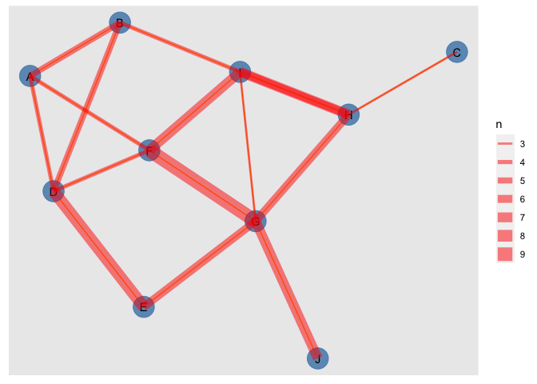
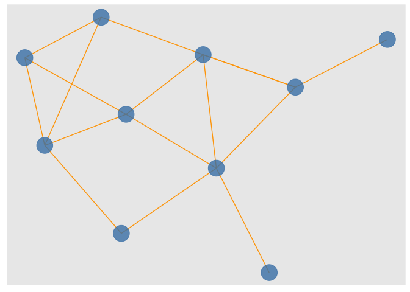
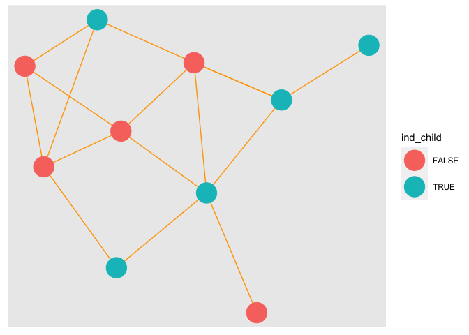
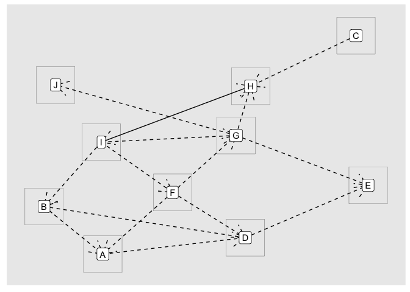
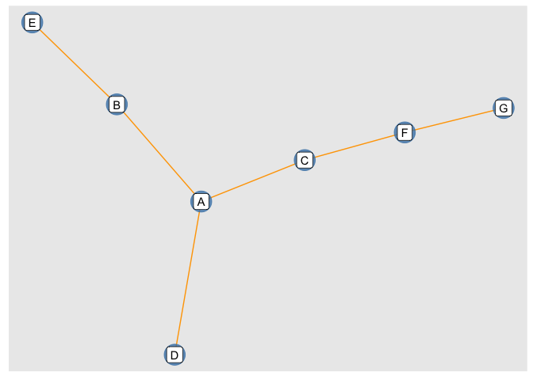
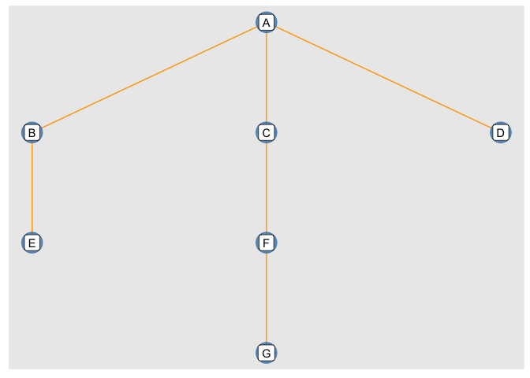
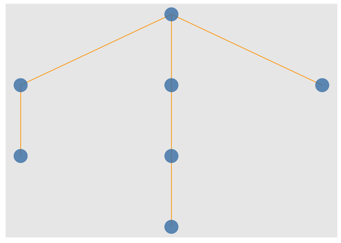
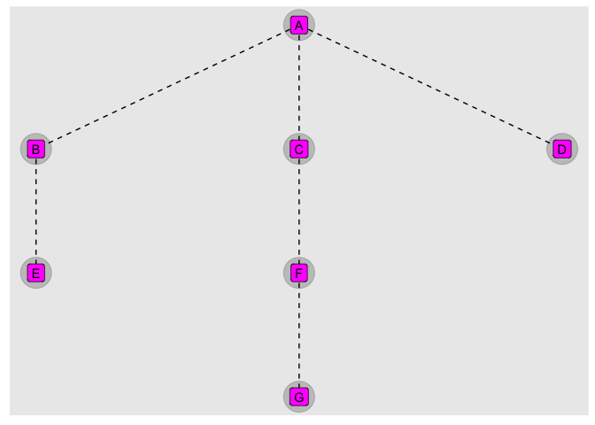
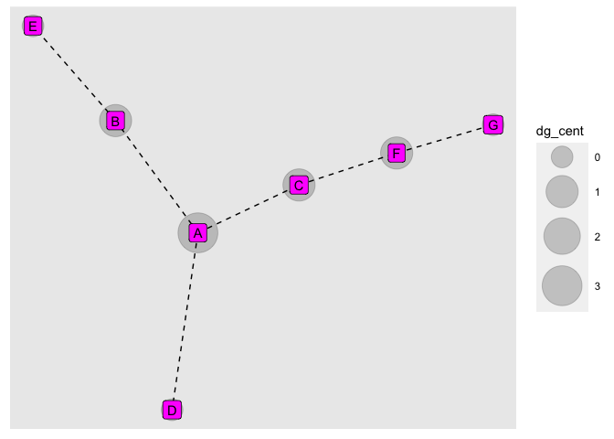

<!-- README.md is generated from README.Rmd. Please edit that file -->

## Intro {ggedgelist} idea

Here we think about a shortcut to a first looks at networks using a
flat, edgelist input that leads straight to a ggplot2 plot (ggraph)
space; this uses {tidygraph} and {ggraph} under the hood…

## Step 00 Before getting into it, create an ‘interesting’ edge list

``` r
library(tidyverse)
library(tidygraph)
library(ggraph)

set.seed(12345)

edge_list <- 
  data.frame(node_to = sample(rep(LETTERS[1:10], 50), 
                              replace = T), 
             node_from = sample(rep(LETTERS[1:10], 50),
                                replace = T)) %>% 
  arrange(node_to, node_from) %>% 
  count(node_to, node_from) %>% 
  sample_n(18)

head(edge_list)
#>   node_to node_from n
#> 1       C         H 3
#> 2       G         H 6
#> 3       I         G 3
#> 4       D         E 8
#> 5       F         A 4
#> 6       G         E 6
```

## Step 0. Whats the status quo edgelist -\> network viz

``` r
edge_list %>% 
  as_tbl_graph() %>% 
  ggraph() +
  geom_edge_link(color = "orange") +
  geom_node_point(size = 9,
                  color = "steelblue",
                  alpha = .8) + 
  geom_node_text(aes(label = name))
#> Using "stress" as default layout
#> Warning: Using the `size` aesthetic in this geom was deprecated in ggplot2 3.4.0.
#> ℹ Please use `linewidth` in the `default_aes` field and elsewhere instead.
#> This warning is displayed once every 8 hours.
#> Call `lifecycle::last_lifecycle_warnings()` to see where this warning was
#> generated.
```


``` r

# aesthetic mapping for edge characteristics
last_plot() + 
  geom_edge_link(color = "red", 
                 alpha = .5 ,
                 aes(edge_width = n))
```



## Step 0.a And to also vizualize node atributes

``` r
node_info <- data.frame(my_nodes = LETTERS[1:10], 
                        ind_child = sample(c(T,F), 10, 
                                           replace = T))

edge_list %>% 
  as_tbl_graph() %>%
  left_join(node_info %>% 
              rename(name = my_nodes)) %>%
  ggraph() +
  geom_edge_link(color = "orange") +
  geom_node_point(size = 9,
                  color = "steelblue",
                  alpha = .8) + 
  geom_node_text(aes(label = name))
#> Joining with `by = join_by(name)`
#> Using "stress" as default layout
```


# Proposed functions, edgelist -\> plotspace feel

``` r
# get into ggplot2 plot space from edge list data frame 
ggedgelist <- function(edgelist, nodelist = NULL, ...)(
  
  # message("'name' a variable created in the 'nodes' dataframe")
  
    if(is.null(nodelist)){
    edgelist %>% 
    tidygraph::as_tbl_graph() %>% 
    ggraph::ggraph(...) 
    
  }else{ # join on nodes attributes if they are available
    
    names(nodelist)[1] <- "name"
    
    edgelist %>% 
    tidygraph::as_tbl_graph() %>%
    dplyr::full_join(nodelist) %>% 
    ggraph::ggraph(...) 
    
  }
  
)

# get a fill viz w edgelist dataframe only
ggedgelist_quick <- function(edgelist, nodelist = NULL, include_names = F,  ...){
  

  p <- ggedgelist(edgelist = edgelist,
                  nodelist = nodelist, ...) +
  ggraph::geom_edge_link(color = "orange") +
  ggraph::geom_node_point(size = 9,
                  color = "steelblue",
                  alpha = .8) 
  
  if(include_names){p + ggraph::geom_node_label(aes(label = name))}else{p}
  
}

geom_node_label_auto <- function(...){ 
  
  ggraph::geom_node_label(aes(label = name), ...)
  
}

geom_node_text_auto <- function(...){ 
  
  ggraph::geom_node_text(aes(label = name), ...)
  
}
```

# examples w/ proposed functions

## `ggedgelist_quick()`

``` r
head(edge_list)
#>   node_to node_from n
#> 1       C         H 3
#> 2       G         H 6
#> 3       I         G 3
#> 4       D         E 8
#> 5       F         A 4
#> 6       G         E 6
head(node_info)
#>   my_nodes ind_child
#> 1        A     FALSE
#> 2        B      TRUE
#> 3        C      TRUE
#> 4        D     FALSE
#> 5        E      TRUE
#> 6        F     FALSE
edge_list %>% 
  ggedgelist_quick() 

edge_list %>% 
  ggedgelist_quick(include_names = T) 

edge_list %>% 
  ggedgelist_quick(nodelist = node_info) + 
  geom_node_point(aes(color = ind_child), size = 10)
```



## `ggedgelist()` + `geom_node_label_auto()`

``` r
edge_list %>% 
  ggedgelist(layout = "kk") + 
  geom_edge_link(arrow = arrow(), linetype = "dashed") +
  geom_node_tile(width = .18, height = .5) + 
  geom_node_label_auto() 
```



# using the ggflowchart example (100% inspiration)

``` r
# flowcharter example
ggflowchart_example <- tribble(~from, ~to,
        "A", "B",
        "A", "C",
        "A", "D",
        "B", "E",
        "C", "F",
        "F", "G") 

ggflowchart_example %>% 
  as_tbl_graph()
#> # A tbl_graph: 7 nodes and 6 edges
#> #
#> # A rooted tree
#> #
#> # A tibble: 7 × 1
#>   name 
#>   <chr>
#> 1 A    
#> 2 B    
#> 3 C    
#> 4 F    
#> 5 D    
#> 6 E    
#> # ℹ 1 more row
#> #
#> # A tibble: 6 × 2
#>    from    to
#>   <int> <int>
#> 1     1     2
#> 2     1     3
#> 3     1     5
#> # ℹ 3 more rows
```

## Start by using quick plot function ‘qedgelist2ggraph’

``` r
ggflowchart_example %>% 
  ggedgelist_quick(layout = "stress", 
                   include_names = T)

ggflowchart_example %>% 
  ggedgelist_quick(layout = "tree", 
                   include_names = T)

# auto which is default also produces three in this case
ggflowchart_example %>% 
  ggedgelist_quick(layout = "auto") 

layer_data(last_plot(), i = 2)
#>    x y PANEL group shape    colour size fill alpha stroke
#> 1  0 3     1    -1    19 steelblue    9   NA   0.8    0.5
#> 2 -1 2     1    -1    19 steelblue    9   NA   0.8    0.5
#> 3  0 2     1    -1    19 steelblue    9   NA   0.8    0.5
#> 4  1 2     1    -1    19 steelblue    9   NA   0.8    0.5
#> 5  0 1     1    -1    19 steelblue    9   NA   0.8    0.5
#> 6 -1 1     1    -1    19 steelblue    9   NA   0.8    0.5
#> 7  0 0     1    -1    19 steelblue    9   NA   0.8    0.5
```



## Use ggedgelist and geom\_edge\_\* and geom\_node\_\* functions to customize

``` r
ggflowchart_example %>% 
  ggedgelist() +
  geom_edge_link(linetype = "dashed") + 
  geom_node_point(size = 12, alpha = .2) + 
  geom_node_label_auto(fill = "magenta")
#> Using "tree" as default layout
```



## Capabilities end here. If you need to access powerful network calculation capabilities, step back into the tidygraph world\!

``` r
ggflowchart_example %>% 
  as_tbl_graph() %>% 
  mutate(dg_cent = centrality_degree()) %>% 
  ggraph("stress") +
  geom_edge_link(linetype = "dashed") + 
  geom_node_point(alpha = .2, aes(size = dg_cent)) + 
  scale_size(range = c(8, 15)) +
  geom_node_label_auto(fill = "magenta")
```



# Part II. Packaging and documentation 🚧 ✅

## Phase 1. Minimal working package

### Created files for package archetecture with `devtools::create(".")` ✅

### Moved functions R folder? ✅

``` r
knitr::knit_code$get() |> names()
#>  [1] "unnamed-chunk-1"           "cars"                     
#>  [3] "unnamed-chunk-2"           "unnamed-chunk-3"          
#>  [5] "ggedgelist"                "unnamed-chunk-4"          
#>  [7] "unnamed-chunk-5"           "unnamed-chunk-6"          
#>  [9] "unnamed-chunk-7"           "unnamed-chunk-8"          
#> [11] "unnamed-chunk-9"           "unnamed-chunk-10"         
#> [13] "unnamed-chunk-11"          "pkg_dependencies"         
#> [15] "pkg_license"               "pkg_check"                
#> [17] "pkg_build"                 "pkg_lifecycle_badge"      
#> [19] "test_calc_frequency_works" "send_tests"               
#> [21] "unnamed-chunk-12"          "session_pkgs"             
#> [23] "report_check"
```

Use new {readme2pkg} function to do this from readme… ✅

``` r
readme2pkg::chunk_to_r("ggedgelist")
```

### Added roxygen skeleton? ✅

Use a roxygen skeleton for auto documentation and making sure proposed
functions are *exported*.

### Managed dependencies ? ✅

Package dependencies managed, i.e. `depend::function()` in proposed
functions and declared in the DESCRIPTION

``` r
usethis::use_package("ggplot2")
#> ✔ Setting active project to '/Users/evangelinereynolds/Google Drive/r_packages/ggedgelist'
#> • Refer to functions with `ggplot2::fun()`
usethis::use_package("ggraph")
#> • Refer to functions with `ggraph::fun()`
usethis::use_package("tidygraph")
#> • Refer to functions with `tidygraph::fun()`
usethis::use_package("dplyr")
#> • Refer to functions with `dplyr::fun()`
```

### Chosen a license? ✅

``` r
usethis::use_mit_license()
```

### Run `devtools::check()` and addressed errors? 🚧

``` r
devtools::check(pkg = ".")
#> ℹ Updating ggedgelist documentation
#> ℹ Loading ggedgelist
#> Error: R CMD check found WARNINGs
```

### Build package 🚧

``` r
devtools::build()
#> ── R CMD build ─────────────────────────────────────────────────────────────────
#> * checking for file ‘/Users/evangelinereynolds/Google Drive/r_packages/ggedgelist/DESCRIPTION’ ... OK
#> * preparing ‘ggedgelist’:
#> * checking DESCRIPTION meta-information ... OK
#> * checking for LF line-endings in source and make files and shell scripts
#> * checking for empty or unneeded directories
#> * building ‘ggedgelist_0.0.0.9000.tar.gz’
#> [1] "/Users/evangelinereynolds/Google Drive/r_packages/ggedgelist_0.0.0.9000.tar.gz"
```

You need to do this before library(mynewpackage) will work.

### Make aspirational part of readme real. 🚧

At this point, you could change eval chunk options to TRUE. You can
remove the 🦄 emoji and perhaps replace it with construction site if you
are still uncertain of the API, and want to highlight that it is subject
to change.

### Add lifecycle badge (experimental)✅

``` r
usethis::use_lifecycle_badge("experimental")
#> • Copy and paste the following lines into 'README.Rmd':
#>   <!-- badges: start -->
#>   [](https://lifecycle.r-lib.org/articles/stages.html#experimental)
#>   <!-- badges: end -->
```

## Phase 2: Listen & iterate 🚧

Try to get feedback from experts on API, implementation, default
decisions. Is there already work that solves this problem?

## Phase 3: Let thinggs settle

### Settled on examples. Put them in the roxygen skeleton and readme. 🚧

### Written formal tests of functions? 🚧

That would look like this…

``` r
library(testthat)

test_that("calc frequency works", {
  expect_equal(calc_frequency("A", 0), 440)
  expect_equal(calc_frequency("A", -1), 220)
})
```

``` r
readme2pkg::chunk_to_tests_testthat("test_calc_frequency_works")
```

### Have you worked added a description and author information in the DESCRIPTION file? 🚧

### Addressed *all* notes, warnings and errors. 🚧

## Promote to wider audience…

### Package website built? 🚧

### Package website deployed? 🚧

## Phase 3: Harden/commit

### Submit to CRAN? Or don’t. 🚧

# Appendix: Reports, Environment

## Description file extract

## Environment

Here I just want to print the packages and the versions

``` r
all <- sessionInfo() |> print() |> capture.output()
all[11:17]
#> [1] ""                                                                         
#> [2] "attached base packages:"                                                  
#> [3] "[1] stats     graphics  grDevices utils     datasets  methods   base     "
#> [4] ""                                                                         
#> [5] "other attached packages:"                                                 
#> [6] " [1] ggedgelist_0.0.0.9000 ggraph_2.1.0          tidygraph_1.2.3      "   
#> [7] " [4] lubridate_1.9.2       forcats_1.0.0         stringr_1.5.0        "
```

## `devtools::check()` report

``` r
devtools::check(pkg = ".")
#> ℹ Updating ggedgelist documentation
#> ℹ Loading ggedgelist
#> Error: R CMD check found WARNINGs
```
